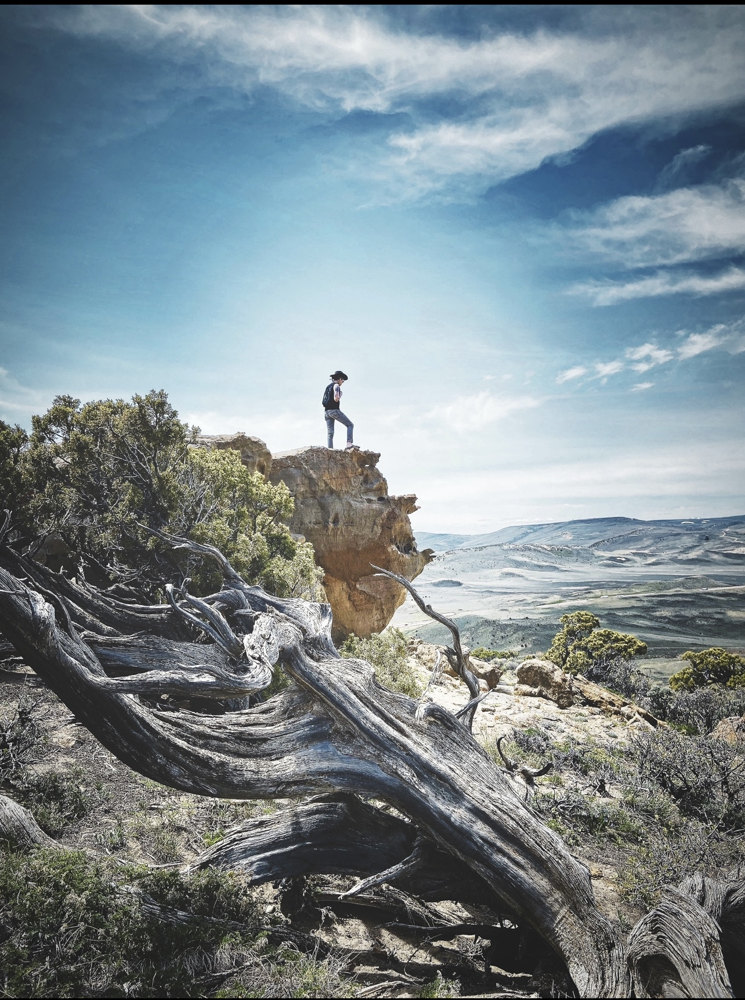

    
    
    
Welcome to my personal research blog—a scholarly space dedicated to sharing insights from fieldwork, research perspectives, and rigorous explorations of both theoretical constructs and imaginative inquiries. My aim is not only to confront the unknown but also to present these challenges in an accessible manner, enabling diverse audiences to engage with and comprehend the intricate dynamics of our Earth system and the extraordinary adaptive strategies that have sustained human societies throughout time.

    
    
<a href="https://jd657824.github.io/blog-index">Start Here: Foundational Concepts & Theoretical Insights</a>

